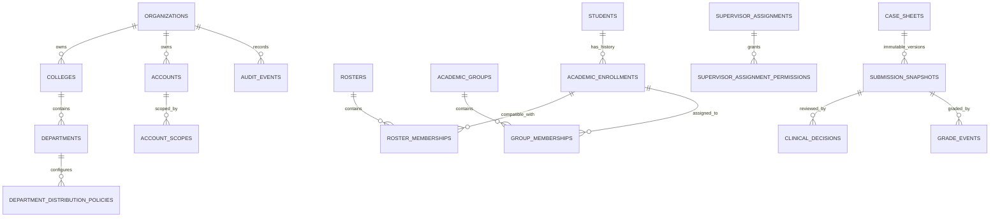

# Production Core Data Model

## حدود المستأجر

`organizations` هو المستأجر. كل aggregate مملوك للكلية يحمل `organization_id`، و`colleges` و`departments` يحددان البنية. تفرض Row-Level Security أن يطابق `organization_id` متغير المعاملة `app.organization_id` الذي تضبطه الجلسة الخادمية، وتبقى foreign keys وفحوص AuthorizationService دفاعًا إضافيًا.

## ERD مختصر

## قواعد وعلاقات حاسمة

| العلاقة أو القيد | سببها | التنفيذ |
| --- | --- | --- |
| Student → Academic Enrollment | الهوية لا تتغير بتغير المستوى/العام. | جداول منفصلة وunique partial للتسجيل النشط في نفس السياق. |
| Roster Membership → Enrollment | لا يمكن ربط roster بتسجيل مختلف في العام/المستوى/المجموعة أو بمؤسسة أخرى. | trigger `validate_roster_membership`. |
| Distribution Policy → Group Membership | Full Cohort لا يسمح بعضوية group؛ Groups Enabled فقط يسمحها. | trigger `validate_group_membership` وفهرس عضوية نشطة وحيدة. |
| Active Group Membership | لا يكون للـenrollment عضوان فعّالان في القسم نفسه. | partial unique index. |
| Submission Snapshot → policy/template/assignment | يمنع إعادة تفسير الإرسال التاريخي بالقواعد الحالية. | references صريحة وpayload JSONB مجمد. |
| Current submission state | يمنع وجود حقيقتين متعارضتين للحالة. | `case_sheets.current_status` فقط؛ لا status current داخل snapshots. |
| Snapshot/Audit/Grade events | التاريخ الأكاديمي والتحقيق لا يقبلان التعديل أو الحذف. | triggers `reject_immutable_mutation`. |
| Term Result Closure | لا يوجد قفل/فتح ضمن سياق ترم مكرر، والقفل يمنع تغيير الحالة/القرار/الدرجة. | unique organization/department/term/level/cohort + service and database lock guards. |
| File Object | لا public key أو ملف خارج tenant. | object key server-generated، metadata وtenant column. |

## JSONB المبرر

تُستخدم JSONB فقط لتعاريف القوالب والسياسات وpayload snapshot والمرفقات وmetadata التدقيق، حيث الحقول ديناميكية أو حيث يلزم حفظ نسخة تاريخية. لا تُخزن علاقات الهوية أو tenant أو الحالة أو actor أو scope أو التواريخ في JSONB.
